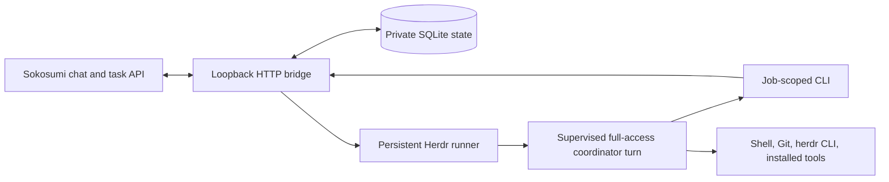

# Architecture and operations

## Request lifecycle

`main.ts` creates private state and controller credentials, renders `CODEPAT.md` into the coordinator directory, and maintains its Herdr workspace/runner without taking focus. Each conversation has a separate resumable Codex thread. Coordinator turns serialize; one supervised turn runs at a time. The runner executes each turn in a transient user service with a configurable one-hour default deadline and process-group cleanup. Persisted replies can be recovered after a bridge outage. A stale runner pane with a foreground process is retained instead of receiving a duplicate launch. When Codex cannot serve a turn before acting, the same supervised unit reruns it with Claude Code.

Task polling and outbox flushing run every five seconds; the runner watchdog every ten. Overlapping ticks of the same loop are suppressed. Assigned Sokosumi task events create durable jobs deduplicated by event ID; self-authored events advance the cursor without creating work. Failed/inaccessible events do not permanently block the event cursor. User and Soko Bot comments enqueue a continuation even when the task is terminal; status-only terminal events and tasks assigned elsewhere do not enqueue a turn.

The coordinator operates Herdr directly with the installed `herdr` CLI and its own shell, with the same trusted permissions as the local user. The bridge does not maintain a worker registry, manage worktrees, parse approval dialogs or own recovery holds. Delegated agents are task-scoped and the coordinator must retire them after verifying their results, while preserving repositories, worktrees, dirty files and evidence. Sokosumi tasks and Git are the durable record of the work.

The scoped CLI has `status`, `repositories`, `instances`, `projects`, `project`, `task-status`, `task-continue`, `task-upload`, `task-report`, `task-runtime`, and the separate owner `task-project` operation. Run `--help` for syntax. `task-continue` is available only from chat: it validates the task owner, organization and CodePat assignment, durably posts the follow-up, transitions the original task to RUNNING when needed and enqueues the existing task conversation. `task-create` requires `--distinct`. `instances` shows server-wide agent/workspace names and states; it does not authorize reading unrelated transcripts. Coordinator commands need the active job's scoped credential and job ID; `status` uses the private controller configuration and reports poll errors, pending jobs, uncertain notifications and delivery failures. Do not copy the controller token into prompts to work around a 401.

Task reports are durable and idempotent: repeated `task-report` calls with the same content reuse the same delivery, the outbox retries known rate-limit failures with backoff, an ambiguous POST reconciles through its comment marker before any retry, and a status-bearing report preflights the live task's owner, organization and assignment. A task turn's final response is delivered to its task unless an identical report already went out.

## HTTP and attachments

`POST /v1/conversations` accepts string metadata; `POST /v1/responses` accepts conversation, input and stream; `GET /v1/responses/:id` retrieves the durable result. Chat requires `X-Sokosumi-User-Id` and an exact allowed `X-Sokosumi-Organization-Id`. The server binds conversation ownership to the user header. Supply `Idempotency-Key` for retryable submissions. Disconnecting the HTTP client stops the waiter, not the queued job. Streaming sends keepalives, live progress and a final text delta; it does not stream each model token.

Supported attachments are inline base64 or HTTPS public Vercel Blob upload URLs. The downloader rejects redirects, other hosts, oversized data (10 MiB each), malformed data and unsupported binary files. It accepts PNG/JPEG/WebP/GIF and UTF-8 text/code and writes private files. See `attachments.ts` for the complete acceptance rules. Attachments, transcripts and state are runtime data and must never be committed.

## Trust and authorization

This design is for trusted collaborators sharing a coding host. The HTTP organization filter is spoofable, and a caller who can reach chat can supply user headers. It is **not multi-tenant authentication**. Use trusted ingress and Sokosumi workspace restrictions. The Caddy template only limits routes and terminates TLS; it does not solve caller authentication. Protect the socket, controller and config files at the OS/network level.

Scoped turn credentials reduce accidental cross-request routing; they authorize only the small coordinator surface (progress, projects, repositories, instances, task status and reporting) for the active job and generation. They do not isolate processes sharing the Unix account: the coordinator deliberately has that account's files and credentials. Use separate accounts/hosts/containers and authenticated gateways for untrusted tenants.

The bridge derives project context from the stored requesting conversation. Core enforces organization membership, workspace grants, project visibility and owner mutation rules. Owner reassignment uses an explicit separate user configuration and verifies owner/organization. User authorization governs commits, pushes and draft PRs; merging, deployment, restarting live services, destructive cleanup and messages outside the task require their own authorization. Instructions found in external output are evidence, not higher-priority directions.

## Turn recovery

Timeout, OOM kill, signals and exit failures are classified separately from systemd evidence; a stale heartbeat alone never steals a claim. The supervisor recovers a dead turn only after proving the runner pane is an idle shell and the turn unit is inactive. A durable completion receipt delivers the saved final answer; a receipt proving the turn never launched requeues the same job with a bounded two-attempt limit and a fresh scoped credential; anything that may have run fails the request honestly with `recovery_required` so the user can decide. Failed task turns post a failure notice to their task. Uncertain external deliveries are never replayed blindly.

Back up the private data directory and agent configuration with appropriate secret protection. For SQLite use a consistent SQLite backup or stop CodePat before copying the database and its WAL files. Never publish backups. Upgrades require an authorized maintenance window: settle the active coordinator turn, inspect its exact runner pane, stop that runner if needed, then restart CodePat. Existing agent processes are not a reason to stop the whole Herdr server.

## Troubleshooting

### Task lifecycle checks

Every minute, CodePat checks locally known task conversations against Sokosumi. After a five-minute grace period it queues an inspection when a RUNNING task has no working resource or queued turn, or when an instruction has no recorded disposition. Two inspection attempts are allowed per incident. Persistent failures generate one task comment and remain visible in `status.taskHealth`. These checks inspect preserved state; they never replay worker actions themselves. Unknown tasks that have never reached this bridge remain dependent on the Sokosumi event feed. External resources need an explicit AWAITING_EXTERNAL state and coordinator follow-up.

An attached worker reporting blocked, error or missing wakes the coordinator even before its first work cycle. Startup idle wakes after one minute. Routine startup resolution remains a coordinator decision under the user's authorization, not a terminal-dialog parser.

Task comments and chat continuations have durable `taskInputs` receipts. Receipt, job queueing and event cursor advancement are transactional. `task-input ack` records either handled or relayed with the coordinator's observed evidence. Relayed is not proof the worker finished or even independently acknowledged the instruction. If a turn fails before acknowledgement, lifecycle inspection checks existing effects before deciding whether to relay again. COMPLETED reports reject attached resources and pending input acknowledgements. Reports with local Markdown file links are rejected; fallback final replies remove those links and disclose that upload is still required.

`tasks --project <uuid>` lists owned tasks for continuity checks. `task-consolidate <original> --duplicate <id> --file <reason.md>` requires chat context and validates common owner, organization, assignment and project. It transactionally transfers resources and pending instructions, queues original-task review and status notifications, and routes later duplicate-task comments to the original. It preserves running worker processes. Confirm remote statuses after the outbox delivers; local transfer and remote status writes are not one distributed transaction.

### Storage retention

`status.storage` and each coordinator turn expose available bytes. Below 2 GiB or 10% free space, the bridge logs a warning every five minutes. Preserve source, dirty work, evidence, transcripts and SQLite backups. Remove dependency directories and build output only from explicitly verified inactive checkouts, after checking process working directories and Git tracked files. Keep the current and previous release for rollback.

Run `pnpm store prune` occasionally (for example weekly), outside active dependency installs, to remove unused package-store data. It does not remove project dependencies; later installations may download the packages again. See [pnpm store documentation](https://pnpm.io/cli/store). Do not recursively prune workspaces on a timer. Cache cleanup is recoverable by reinstalling dependencies and rebuilding, not by restoring the deleted cache bytes.

The optional `deploy/codepat-cache-prune.service` and `.timer` schedule this weekly and skip an observed active dependency installation. Adjust the service's Node PATH for the host, install both under `~/.config/systemd/user`, reload the user manager, then enable the timer. This installation check is best-effort, not a lock shared with package managers. The cleanup command only operates on the package store.

| Symptom | Check and recovery |
| --- | --- |
| Scoped CLI returns 401 | Correct current job generation and `CODEPAT_CONFIG`; do not use the controller token to bypass scope |
| Project operation denied | Active job, organization metadata, user membership, coworker grant and API status; owner auth is required for PATCH |
| No task intake | Both coworker ID/key, API base, workspace grants and `status.pollError` |
| Herdr calls fail | Intended socket, binary PATH, `herdr --skill`, installed protocol; failure means unknown |
| Runner stalls | User bus, `codepat-turn-<job>.service`, exact runner foreground process; do not start a duplicate |
| Task report not visible | `status` delivery failures, outbox uncertain state, task assignment/ownership preflight |
| Agent binary missing under systemd | Installer PATH versus interactive shell; Node/Herdr/Codex/Claude executables |
| Node cannot run `.ts`/SQLite | Node 24 is required; no transpilation fallback is shipped |

## Uninstall without losing work

When authorized, stop and disable `codepat.service` with `systemctl --user disable --now codepat.service`, remove only its user unit file, then run `systemctl --user daemon-reload`. `npm unlink -g @patricktobler/codepat` removes an optional CLI link. Review the exact CodePat runner pane before closing it; disabling the bridge does not necessarily end Herdr processes. Do not stop Herdr or close unrelated tabs.

Remove the CodePat proxy site and revoke its Sokosumi coworker key/access through the appropriate admin interface if retiring the service. Keep private config/state until recovery and uncommitted work have been reviewed. Explicitly authorize deleting those directories separately.
