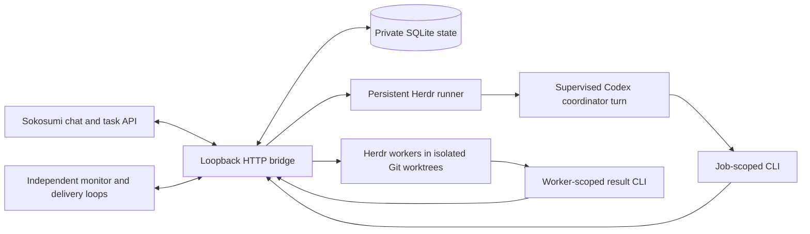

# Architecture and operations

## Request and worker lifecycle

`main.ts` creates private state and controller credentials, renders `CODEPAT.md` into the coordinator directory, and maintains its Herdr workspace/runner without taking focus. Each conversation has a separate resumable Codex thread. Coordination turns serialize, while coding workers continue concurrently. The runner executes each turn in a transient user service with a 180-second deadline and process-group cleanup. Persisted replies can be recovered after a bridge outage. A stale runner pane with a foreground process is retained instead of receiving a duplicate launch.

The monitor/recovery/cleanup loop runs every three seconds; instruction delivery every two seconds; task polling and outbox flushing every five seconds; runner watchdog every ten seconds. These loops continue independently of model turns. Overlapping ticks of the same loop are suppressed. Monitor errors are unknown observations, never evidence that work finished. Assigned task events create durable jobs; canceled/reassigned tasks pause their managed workers. Failed/inaccessible events do not permanently block the event cursor.

A chat worker first reserves an operation record, creates a Sokosumi task owned by the requesting user in their organization with the selected project and CodePat assignment, then prepares its Git worktree and Herdr tab. Existing task intake reuses the task ID. Supported worker kinds are `codex` (default) and `claude`; unsupported values fail before task creation. The chosen kind survives retries and follow-ups. Codex workers launch with `-s danger-full-access -a never`; Claude uses `--permission-mode acceptEdits`. Interactive Claude permission requests remain human decisions. The coordinator is always Codex.

`send` steers an owned busy worker; blocked workers retain queued messages. `stop` interrupts only a verified owned pane and invalidates its old reporting generation. `resume` retries the same repaired worker, preserving task/worktree identity. `read` retrieves recent owned output (or the saved result for archived workers). A terminal/idle Herdr state is not proof of completion: the worker must submit `worker-result`, and the coordinator must review evidence and post `task-report`. Sibling unfinished workers prevent a COMPLETED task report.

The CLI has `status`, `repositories`, `instances`, `workers`, `projects`, `project`, `start`, `send`, `stop`, `resume`, `read`, `worker-result`, `task-report`, the owner `task-project` operation, and the [native contact commands](contacts.md) `contacts`, `dm-send`, `dm-status`, and `dm-retry`. Run `--help` for syntax. `instances` shows server-wide agent/workspace names and states; it does not authorize reading unrelated transcripts. Most commands need an active job; worker scope authorizes only its own result and generation. `status` uses the private controller configuration and reports monitor errors, pending jobs, uncertain notifications and delivery failures. Do not copy that controller token into worker prompts to work around a 401.

## HTTP and attachments

`POST /v1/conversations` accepts string metadata; `POST /v1/responses` accepts conversation, input and stream; `GET /v1/responses/:id` retrieves the durable result. Chat requires `X-Sokosumi-User-Id` and an exact allowed `X-Sokosumi-Organization-Id`. The server binds conversation ownership to the user header. Supply `Idempotency-Key` for retryable submissions. Disconnecting the HTTP client stops the waiter, not the queued job. Streaming sends keepalives and a final text delta; it does not stream each model token.

Supported attachments are inline base64 or HTTPS public Vercel Blob upload URLs. The downloader rejects redirects, other hosts, oversized data (10 MiB each), malformed data and unsupported binary files. It accepts PNG/JPEG/WebP/GIF and UTF-8 text/code, writes private files and supplies untrusted-input paths to workers. See `attachments.ts` for the complete acceptance rules. Attachments, transcripts and state are runtime data and must never be committed.

Direct-chat metadata supplies a room destination; background results use `POST /chats/rooms/{id}/messages`. Thread/mention correlations may be message IDs, so they are not guessed as room IDs. Without a valid destination, background results stay on the task and normal thread replies still work. Distinguish queued, delivered, uncertain and failed messages. The outbox retries known rate-limit failures with backoff; ambiguous task event posts reconcile via their comment marker. Coworker keys cannot read room history, so ambiguous room posts are not blindly replayed.

## Trust and authorization

This design is for trusted collaborators sharing a coding host. The HTTP organization filter is spoofable, and a caller who can reach chat can supply user headers. It is **not multi-tenant authentication**. Use trusted ingress and Sokosumi workspace restrictions. The Caddy template only limits routes and terminates TLS. It does not solve caller authentication. Protect the socket, controller and config files at the OS/network level.

Scopes reduce accidental cross-user routing; they do not isolate processes with the same Unix account. Agents can access that account's files and network credentials. Worktrees isolate code edits, not secrets or execution. Use separate accounts/hosts/containers and authenticated gateways for untrusted tenants. Server-wide inventory is deliberately broader than owned-worker transcript access. Model-provided repository paths are not an allowlist.

The bridge derives project context from the stored requesting conversation. Core enforces organization membership, workspace grants, project visibility and owner mutation rules. No worker task/project operation can opt into an administrator credential. Owner reassignment uses an explicit separate user configuration and verifies owner/organization. Keep its credential outside the shared host when that is required by your trust model.

User authorization governs commits, pushes and draft PRs. Merging, deployment, restarting live services, destructive cleanup and messages outside the task require their own authorization. Prompts and tools must not auto-approve interactive human dialogs. Instructions in external output are evidence, not higher-priority directions.

## Resource lifecycle and recovery

Completed worker panes close after 15 idle minutes, provided review, instruction delivery and task reporting have settled. Cleanup checks live agent name and working directory, and serializes against worker operations. Busy, blocked, stopped and unrelated agents remain; the persistent coordinator is never eligible. Worktrees, branches, records, results and agent session histories remain on disk. Report an archived worker as completed with its process stopped to save memory. Follow-up `send`/`resume` reopens the same session/worktree (`codex resume --last`, Claude `--continue`). Disk cleanup is explicit because uncommitted code may remain.

Stable start keys prevent duplicate workers within a job. Failed launch records reserve identity. Repair the cause, inspect the owned pane/worktree and use `resume`; do not launch a replacement task. A task create may have committed despite a failed response. Search owned tasks for its unique worker reference and reconcile before any recovery. Pending/sending/uncertain delivery records survive restart. Do not automatically resend an uncertain instruction.

Back up the private data directory and agent configuration with appropriate secret protection. For SQLite use a consistent SQLite backup or stop CodePat before copying the database and its WAL files. Preserve worktrees and Git metadata together; deleting the database loses ownership and delivery records. Never publish backups. Upgrades require an authorized maintenance window: settle the active coordinator turn, inspect its exact runner pane, stop that runner if needed, then restart CodePat. Existing worker processes are not a reason to stop the whole Herdr server. Review logs/status and reconcile uncertain operations before retrying.

## Troubleshooting

| Symptom | Check and recovery |
| --- | --- |
| Scoped CLI returns 401 | Correct current job/worker generation and `CODEPAT_CONFIG`; do not use the controller token to bypass scope |
| Project operation denied | Active job, organization metadata, user membership, coworker grant and API status; owner auth is required for PATCH |
| Task remains launch_failed | Inspect reserved task/worktree/pane, repair repository/tool/API access, then resume the same worker |
| No task intake | Both coworker ID/key, API base, workspace grants and `status.pollError` |
| Herdr monitor fails | Intended socket, binary PATH, `herdr --skill`, installed protocol; failure means unknown |
| Runner stalls | User bus, `codepat-turn-<job>.service`, exact runner foreground process; do not start a duplicate |
| Completed result not seen | Worker-result receipt, coordinator review, task report and outbox/delivery failure state |
| Chat background destination fails | Direct room metadata versus thread/mention ID; results remain on task |
| Agent binary missing under systemd | Installer PATH versus interactive shell; Node/Herdr/Codex/Claude executables |
| Node cannot run `.ts`/SQLite | Node 24 is required; no transpilation fallback is shipped |

## Uninstall without losing work

When authorized, stop and disable `codepat.service` with `systemctl --user disable --now codepat.service`, remove only its user unit file, then run `systemctl --user daemon-reload`. `npm unlink -g @patricktobler/codepat` removes an optional CLI link. Review exact CodePat-owned worker/runner panes before closing them; disabling the bridge does not necessarily end their Herdr processes. Do not stop Herdr or close unrelated tabs.

Remove the CodePat proxy site and revoke its Sokosumi coworker key/access through the appropriate admin interface if retiring the service. Keep private config/state and worktrees until recovery and uncommitted work have been reviewed. Explicitly authorize deleting those directories separately. Do not disable lingering or remove shared agent/Git configuration needed by other services.
